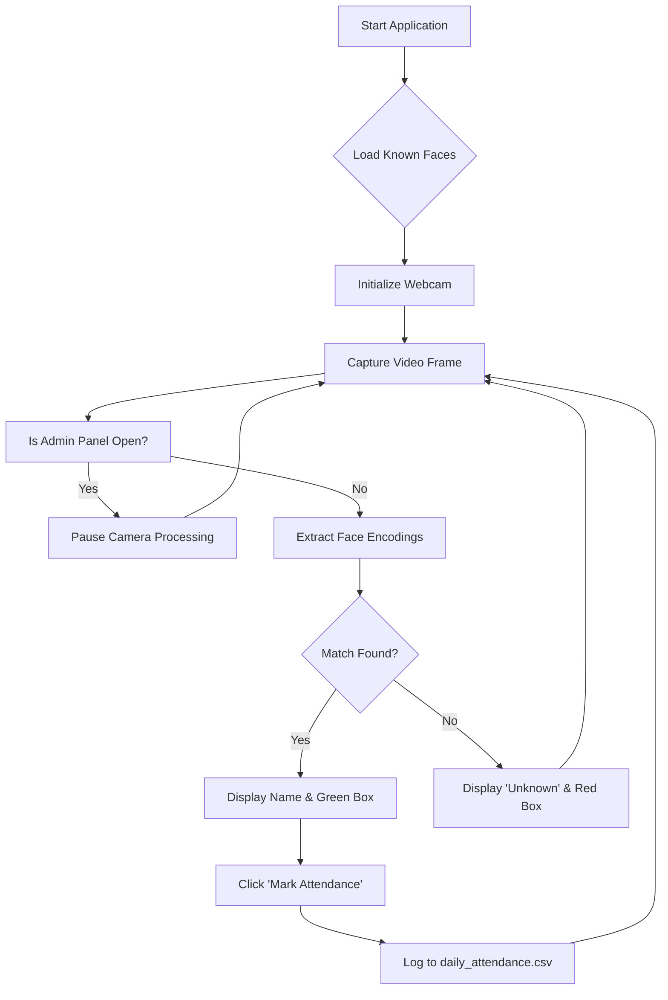

# Project Report: Smart Attendance System using Face Recognition

This document contains structured content suitable for creating a PowerPoint presentation for your college lab project.

---

## Slide 1: Title
**Smart Attendance System**
*Automated classroom attendance using AI & Facial Recognition*
**Name:** Sunil Dehru
**Course:** [Insert Course Name]

---

## Slide 2: Project Objective
- To replace manual, time-consuming roll calls with an automated, biometric system.
- To use a standard webcam to detect, verify, and log student attendance in real-time.
- To provide a secure admin portal to easily add, remove, and manage student enrollments.

---

## Slide 3: Libraries & Technologies Used
The project is built entirely in Python, utilizing modern libraries for UI and AI processing.

1. **`face_recognition`**: The core AI library. It uses deep learning models (dlib) to map faces into 128-dimensional vectors for accurate comparison.
2. **`opencv-python` (cv2)**: Used to connect to the physical webcam hardware and process live video frames.
3. **`customtkinter`**: A modern, hardware-accelerated GUI library used to create the dark-themed desktop interface.
4. **`numpy`**: Handles the complex matrix mathematics and distance calculations when comparing faces.
5. **`Pillow` (PIL)**: Used to translate OpenCV image arrays into a format that the UI can display smoothly.
6. **`json` & `csv`**: Used for database management (storing student details and exporting daily logs).

---

## Slide 4: System Architecture & Modules
The application is split into three main modules:

1. **User Interface Module:** Handles the visual rendering, buttons, sidebars, and real-time toast notifications.
2. **Computer Vision Module:** Connects to the camera, resizes frames for performance, and draws bounding boxes around detected faces.
3. **Admin & Database Module:** Manages the `students.json` file and handles the secure addition/removal of face encodings on disk.

---

## Slide 5: How It Works (Workflow Diagram)

*(Note: You can screenshot this diagram for your PPT or recreate it using SmartArt)*

---

## Slide 6: Key Features & Optimizations
- **Thread Safety:** The app uses background threading to load faces, ensuring the main UI never freezes during heavy operations.
- **Auto-Capture:** During registration, the system waits until exactly 1 face is stable for 5 frames before taking the picture, preventing blurry or empty enrollments.
- **Hardware Efficiency:** The camera pauses processing when the admin panel is open, saving CPU power, and uses frame-skipping (`PROCESS_EVERY_N_FRAMES = 3`) to maintain high FPS.

---

## Slide 7: Conclusion
The Smart Attendance System successfully demonstrates how computer vision can be deployed in a practical, real-world desktop application. By combining `customtkinter` for a polished UI and `face_recognition` for accurate AI processing, it provides a seamless, professional-grade solution for classroom management.
